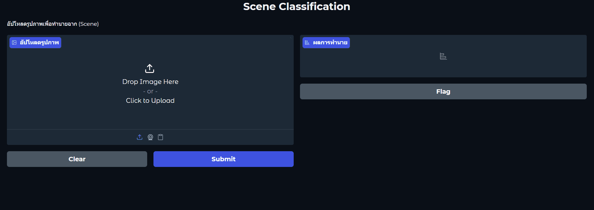
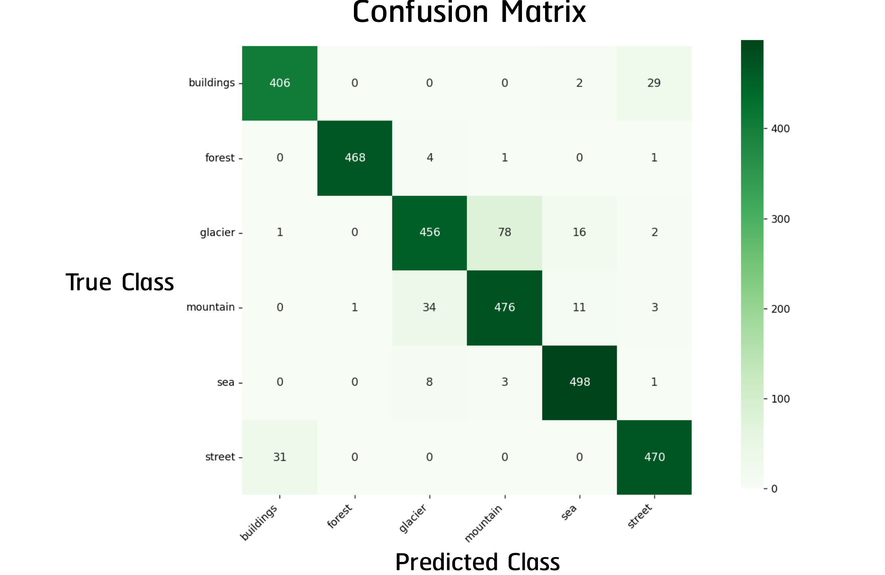
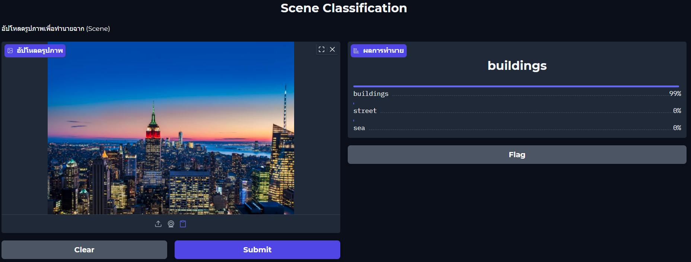
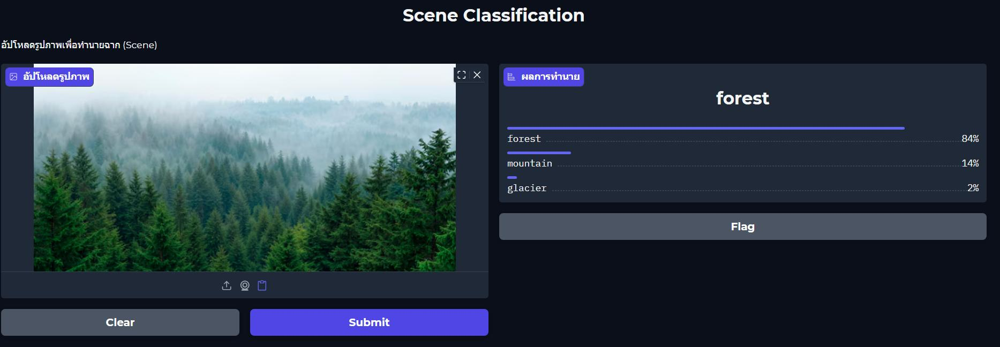
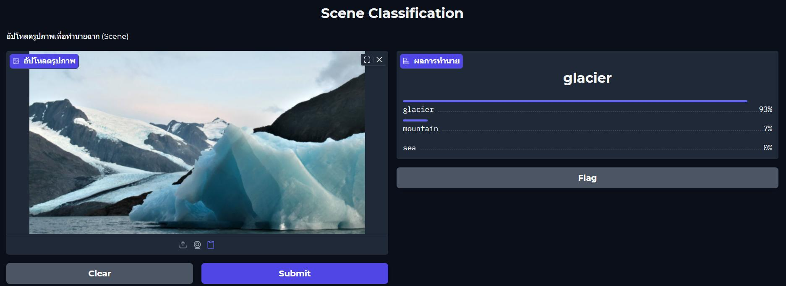
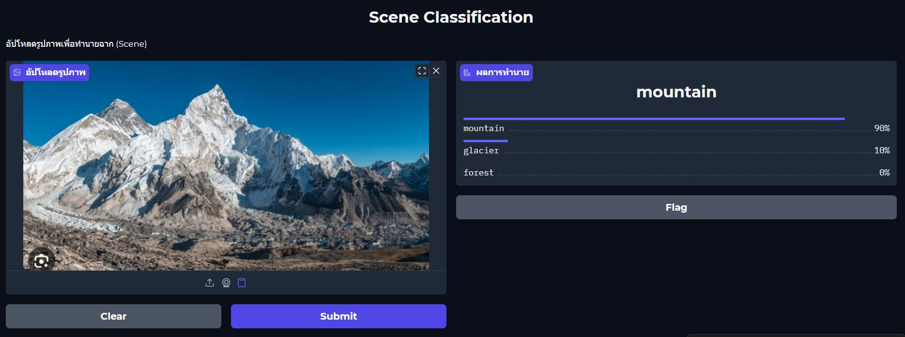
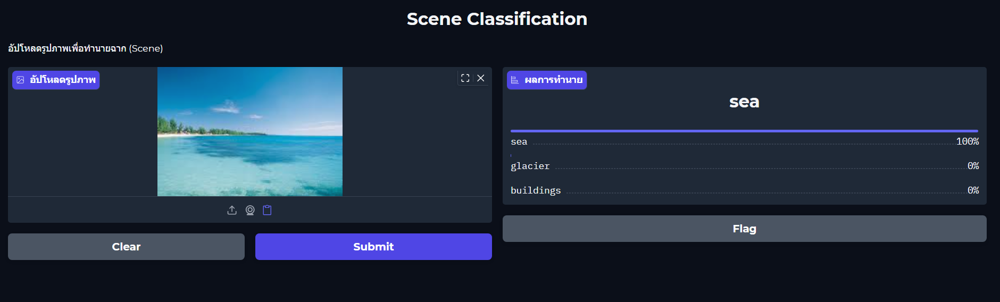
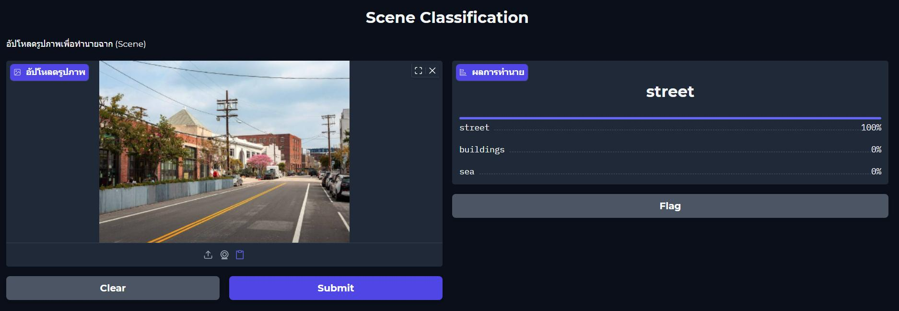

# Computer Vision Mini Project — Scene Classification with EfficientNetB0

มินิโปรเจกต์การจำแนกประเภทภาพวิวทิวทัศน์และฉากธรรมชาติ (Scene Classification) 6 คลาส ด้วยโมเดล Deep Learning โดยใช้เทคนิค Transfer Learning บนสถาปัตยกรรม **EfficientNetB0** พร้อมพัฒนาหน้าเว็บแอปพลิเคชันสำหรับทดสอบทำนายผลแบบอินเตอร์แอคทีฟด้วย **Gradio**

<div align="center">
  
  <p><em>ตัวอย่างการทดสอบใช้งานโมเดลผ่าน Web GUI บน Gradio</em></p>
</div>

---

## 1. หมวดหมู่ภาพและชุดข้อมูล (Scene Classes & Dataset)

โมเดลได้รับการฝึกเพื่อจำแนกภาพฉากออกเป็น 6 กลุ่ม จากชุดข้อมูล **Intel Image Classification**:

| คลาส (Class) | คำอธิบายฉาก | ตัวอย่างภาพ (ในโฟลเดอร์ `samples/`) |
|---|---|:---:|
| **Buildings** | อาคาร สิ่งก่อสร้าง ตึกสูง และสถาปัตยกรรมเมือง |  |
| **Forest** | ป่าไม้ ต้นไม้ และธรรมชาติป่าเขาเขียวขจี |  |
| **Glacier** | ธารน้ำแข็ง แผ่นน้ำแข็งขั้วโลก และภูเขาน้ำแข็ง |  |
| **Mountain** | ทิวเขา ยอดเขาหิน และภูเขาสูงชัน |  |
| **Sea** | ทะเล ชายหาด คลื่น และผืนน้ำมหาสมุทร |  |
| **Street** | ถนน เส้นทางสัญจรในตัวเมือง ยานพาหนะ และคนเดินเท้า |  |

---

## 2. โครงสร้างโมเดลและการฝึก (Model Architecture & Training)

- **โมเดลหลัก (Backbone):** EfficientNetB0 โหลดน้ำหนักเริ่มต้นจาก ImageNet
- **การปรับแต่งสถาปัตยกรรม (Fine-Tuning Head):**
  - ตรึงเลเยอร์ (Freeze Layers) ของโมเดลฐาน
  - เพิ่ม Global Average Pooling 2D
  - เพิ่ม Fully Connected (Dense) 128 โหนด พร้อมฟังก์ชันกระตุ้น ReLU
  - ใส่ Dropout Rate 0.3 เพื่อลดโอกาสเกิด Overfitting
  - เลเยอร์เอาต์พุต Dense 6 คลาส พร้อม Softmax Activation
- **พารามิเตอร์การฝึก:**
  - Input Shape: 224 × 224 พิกเซล (3 Channels RGB)
  - Batch Size: 16
  - Normalization: `preprocess_input` มาตรฐานของ EfficientNet

<div align="center">
  
  <p><em>กราฟการเปลี่ยนแปลงค่า Loss และ Accuracy ตลอดช่วงการฝึกโมเดล</em></p>
</div>

---

## 3. ผลการประเมินประสิทธิภาพ (Performance Evaluation)

ประเมินผลการทดสอบด้วยชุดข้อมูล Test Set จำนวน 3,000 ภาพ (500 ภาพต่อคลาส):

- **ความแม่นยำรวม (Overall Accuracy):** 93.0%
- **Macro Average F1-score:** 0.93
- **Weighted Average F1-score:** 0.93

<div align="center">
  
  <p><em>ตาราง Confusion Matrix แสดงการกระจายผลทำนายจริงบนชุดทดสอบ 3,000 ภาพ</em></p>
</div>

---

## 4. ตัวอย่างผลการทดสอบทำนายผล (Prediction Showcase)

ผลการทดสอบรันภาพฉากประเภทต่างๆ ผ่านเว็บแอปพลิเคชัน Gradio:

<div align="center">
  <table>
    <tr>
      <td align="center" width="50%">
        <br>
        <b>Buildings: ความมั่นใจ 99%</b>
      </td>
      <td align="center" width="50%">
        <br>
        <b>Forest: ความมั่นใจ 100%</b>
      </td>
    </tr>
    <tr>
      <td align="center" width="50%">
        <br>
        <b>Glacier: ความมั่นใจ 93%</b>
      </td>
      <td align="center" width="50%">
        <br>
        <b>Mountain: ความมั่นใจ 98%</b>
      </td>
    </tr>
    <tr>
      <td align="center" width="50%">
        <br>
        <b>Sea: ความมั่นใจ 100%</b>
      </td>
      <td align="center" width="50%">
        <br>
        <b>Street: ความมั่นใจ 97%</b>
      </td>
    </tr>
  </table>
</div>

---

## 5. การเปิดใช้งานและการทดสอบ (Getting Started)

ภายใน repository มีไฟล์โมเดลที่ฝึกสำเร็จแล้ว `scene_model.keras` และดัชนีคลาส `class_indices.json` พร้อมรูปภาพตัวอย่างในโฟลเดอร์ `samples/` สามารถเปิดใช้งานได้ทันทีโดยไม่ต้องโหลด Dataset เพิ่มเติม:

```sh
# 1. สร้างและเปิดใช้งาน Virtual Environment (แนะนำ Python 3.10)
python -m venv .venv
.venv\Scripts\activate

# 2. ติดตั้งแพ็กเกจที่จำเป็น
pip install -r requirements.txt

# 3. เริ่มต้นเปิดเว็บแอปพลิเคชัน
python app.py
```

เมื่อโปรแกรมเริ่มทำงาน ให้เปิดลิงก์ URL ท้องถิ่น (เช่น `http://127.0.0.1:7860`) บนเว็บเบราว์เซอร์ คุณสามารถอัปโหลดภาพวิวทิวทัศน์ใหม่ หรือคลิกภาพตัวอย่างในกล่อง **Examples** ด้านล่างหน้าจอเพื่อดูผลวิเคราะห์ความน่าจะเป็น 3 อันดับแรกได้ทันที

---

## 6. โครงสร้างไฟล์ใน Repository

```text
computer-vision-mini-project-scene-classification/
├── app.py                     # เว็บแอปพลิเคชัน Gradio สำหรับทำนายผลแบบเรียลไทม์
├── train.py                   # สคริปต์สร้างและฝึกโมเดล Transfer Learning
├── evaluate.py                # สคริปต์ประเมินผลชุดทดสอบและคำนวณ Confusion Matrix
├── make_val.py                # สคริปต์แบ่งสัดส่วนข้อมูล Validation Set
├── scene_model.keras          # ไฟล์โมเดล EfficientNetB0 ที่ผ่านการฝึกเรียบร้อยแล้ว
├── class_indices.json         # แผนผังจับคู่ดัชนีตัวเลขกับชื่อคลาสทั้ง 6
├── train_history.json         # ประวัติบันทึกค่า Loss/Accuracy ระหว่างการฝึก
├── demo.gif                   # ภาพเคลื่อนไหวสาธิตการทำงานของโปรแกรม
├── training-history.png       # กราฟแสดงสถิติการฝึกโมเดล
├── samples/                   # ภาพตัวอย่างสำหรับทดสอบโมเดลครบทั้ง 6 คลาส
├── docs/images/               # แผนผังผลลัพธ์ Confusion Matrix และภาพทดสอบ
└── requirements.txt           # รายการไลบรารีที่จำเป็นสำหรับโปรเจกต์
```
